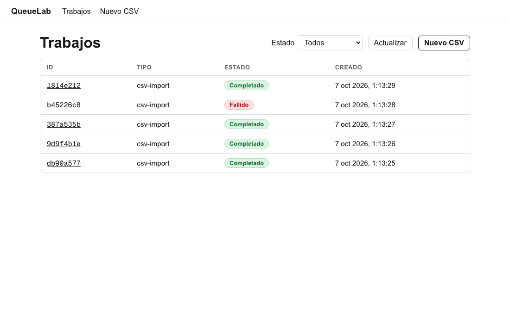
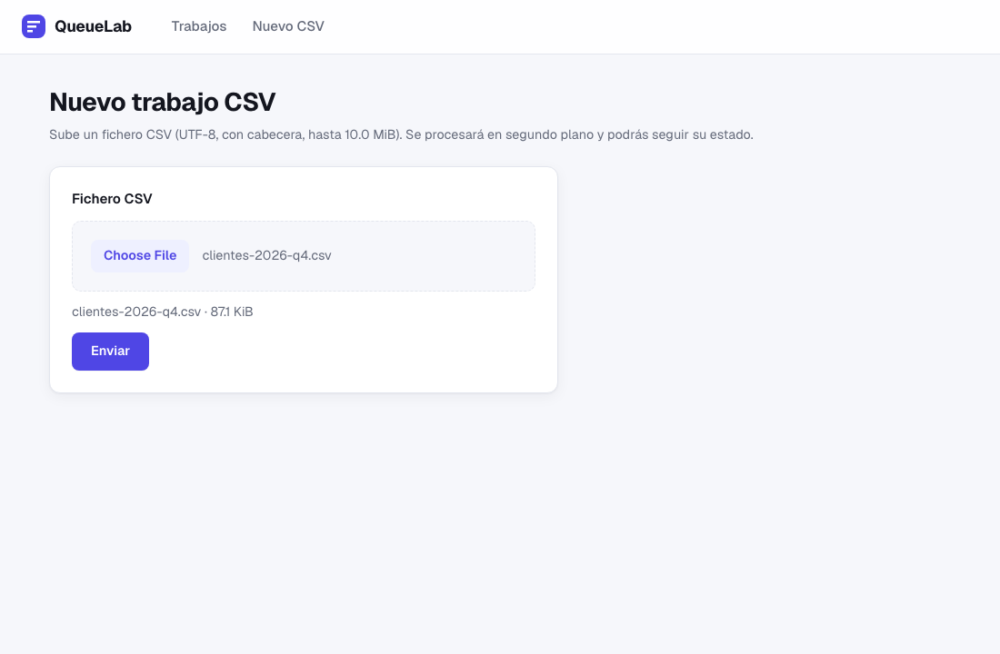
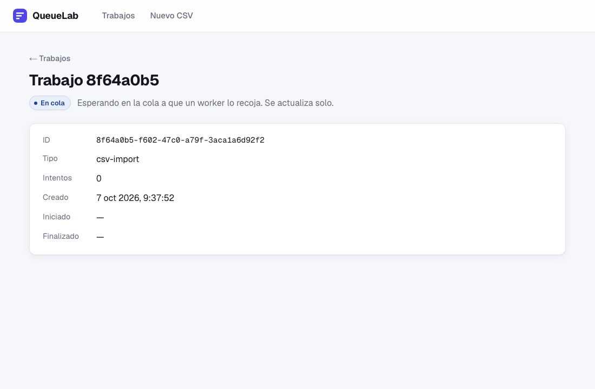
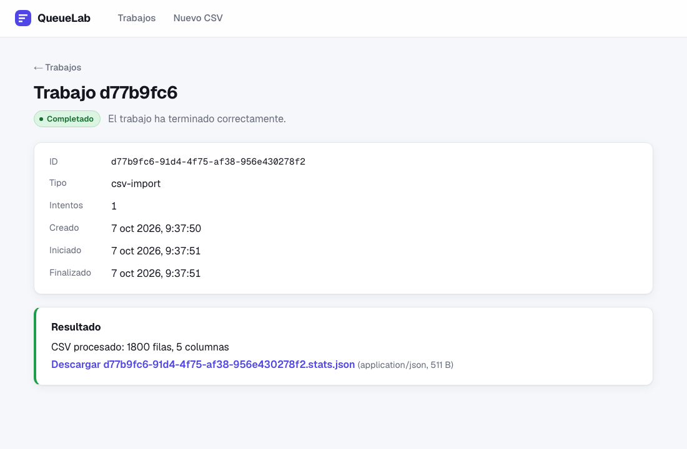
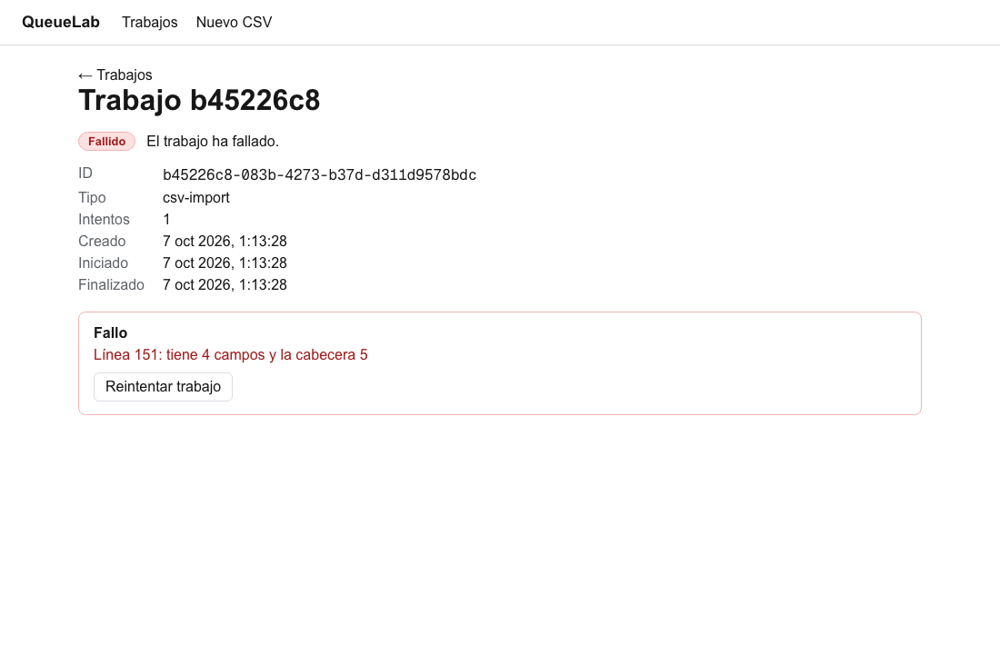
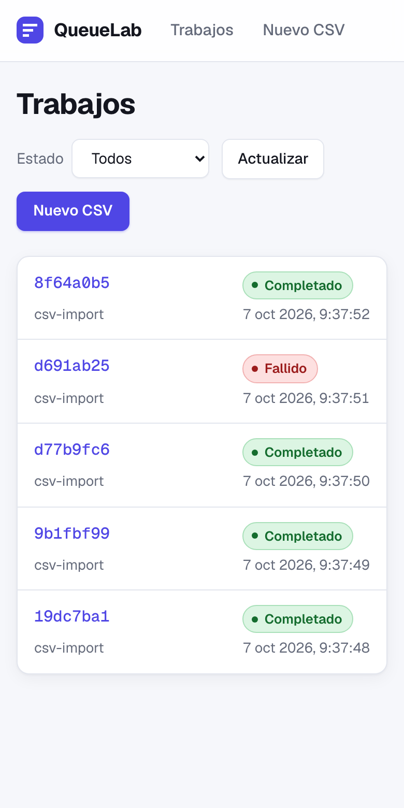
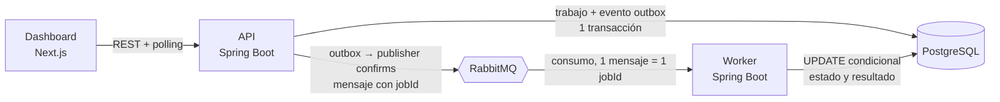

<div align="center">

# QueueLab

**Cola de trabajos asíncronos con API REST, worker independiente y dashboard, para estudiar cómo se construye un sistema distribuido que no pierde trabajos.**

[](https://github.com/Cosmichomeless/QueueLab/actions/workflows/backend.yml)
[](https://github.com/Cosmichomeless/QueueLab/actions/workflows/frontend.yml)


[Probarlo](#probarlo-en-un-comando) · [Capturas](#capturas) · [Arquitectura](#arquitectura) · [Limitaciones](#limitaciones-conocidas) · [Documentación](#documentación)

</div>

QueueLab recibe un CSV por una API REST, lo encola en RabbitMQ y lo procesa en un worker aparte que calcula estadísticas por columna. Es un proyecto de estudio: demuestra outbox transaccional, reintentos, dead-letter queue, idempotencia y observabilidad, no un producto listo para producción.

## Qué incluye

- **Outbox transaccional:** el trabajo y su evento `JOB_QUEUED` se guardan en la misma transacción de PostgreSQL; un dispatcher los publica con publisher confirms y `FOR UPDATE SKIP LOCKED`.
- **Entrega al menos una vez, sin ejecutar dos veces:** el worker reclama el trabajo con un `UPDATE ... WHERE status = 'QUEUED'`; 3 intentos con espera exponencial (5 s ×2, máximo 5 min), DLQ y recuperación por lease de 2 min. `Idempotency-Key` en la API.
- **API que se protege:** responde 503 con 1.000 trabajos pendientes (contrapresión) y 429 por encima de 60 envíos por minuto y por IP (cuota en Redis).
- **Un trabajo real:** `csv-import` lee CSV de hasta 10 MiB en streaming y escribe un `<jobId>.stats.json` con estadísticas por columna.
- **Observabilidad:** métricas Prometheus, dashboard de Grafana provisionado, trazas OpenTelemetry que unen petición HTTP, outbox y worker, y logs con id de correlación.
- **Medido, no supuesto:** con 8 hilos el worker pasa de 8,3 a 40,2 trabajos/s (4,84×) sobre un CSV de 8,6 MiB y 150.000 filas.

## Probarlo en un comando

> **No hay demo pública:** no existe ningún despliegue. Solo corre en local con Docker.

```bash
docker compose up -d --wait   # PostgreSQL, RabbitMQ, Redis, API, worker y dashboard; la primera vez construye las imágenes (unos minutos)
```

Abre `http://127.0.0.1:3000`, pulsa **Nuevo CSV** y sube un fichero. Para parar: `docker compose down` (conserva los datos). Con Prometheus y Grafana, API y puertos: [`docs/compose-stack.md`](docs/compose-stack.md).

## Capturas

| **Lista de trabajos** | **Nuevo trabajo CSV** |
| --- | --- |
|  |  |
| **Trabajo en cola** | **Trabajo completado** |
|  |  |
| **Trabajo fallido** | **Detalle en móvil** |
|  |  |

Se regeneran con `./scripts/screenshots.sh`: levanta un Compose limpio en el proyecto `queuelab-shots` (sin tocar tus volúmenes), siembra por la API cinco CSV deterministas con datos de `example.com`, captura con Playwright y lo apaga. Necesita los puertos 3000 y 8080 libres, `npm ci` en `frontend/` y `npx playwright install chromium`. Los ids y las fechas cambian en cada ejecución.

## Arquitectura



- **API (`backend/api`):** valida y guarda el trabajo, publica el outbox y sirve estado y resultados. Es la dueña del esquema (migraciones Flyway). Redis solo guarda los contadores de la cuota por IP.
- **Worker (`backend/worker`):** sin HTTP de negocio. Reclama, ejecuta y escribe el estado (`QUEUED` → `RUNNING` → `COMPLETED` / `FAILED`, con `RETRYING` entre intentos); lo que no puede procesar acaba en la DLQ `queuelab.jobs.queued.dlq`.
- **Datos:** PostgreSQL es la fuente de verdad y RabbitMQ solo transporta el `jobId`. Los ficheros de entrada y resultado viven en un volumen compartido por API y worker.

## Decisiones de diseño

| Decisión | Por qué | Coste |
| --- | --- | --- |
| **Outbox en vez de publicar en RabbitMQ tras el commit** | Si el proceso cae entre el commit y la publicación no se pierde el evento: queda en la tabla. | Una tabla y un dispatcher más; el techo de publicación es ≈49 eventos/s con la configuración por defecto. |
| **Reclamo con `UPDATE ... WHERE status = 'QUEUED'` en vez de locks distribuidos** | Un mensaje duplicado no ejecuta el trabajo dos veces: el segundo reclamo no actualiza ninguna fila. | Entrega al menos una vez: hay duplicados que se descartan en el worker, no en el broker. |
| **Mensaje solo con `jobId` en vez de llevar el contenido** | PostgreSQL es la única fuente de verdad; el mensaje no puede quedar desfasado. | Cada consumo lee la base de datos. |
| **Concurrencia fija por worker en vez de adaptativa** | Predecible: 8 hilos dan 40,2 trabajos/s. | Con 16 hilos el throughput no mejora y la latencia p50 pasa de 133 a 272 ms; hay que ajustarla a mano. |
| **Cuota de envíos en Redis en vez de en memoria** | Los contadores se comparten entre varias instancias de la API. | Una dependencia más; si Redis cae, la API deja de limitar. |

## Limitaciones conocidas

- **Sin autenticación ni autorización:** cualquiera que alcance la API puede crear y consultar trabajos (hallazgo H3 de la [revisión de seguridad](docs/security/upload-api-review.md), el riesgo principal).
- **La cuota usa la IP del socket:** detrás de un proxy inverso todos los clientes comparten contador (H4). Si Redis no responde, no se limita.
- **Ficheros sin cifrar y sin cuota total de almacenamiento** (H7); sin TLS en ningún punto.
- **Solo dos tipos de trabajo:** `noop` y `csv-import`. No hay otros.
- **Rendimiento medido en una sola máquina** (Apple M4 Pro, todo en local), con un solo worker y una sola API, y con la cuota y la contrapresión desactivadas. No se ha medido con varios workers ni varias APIs.
- **La tabla de la lista de trabajos se recorta en pantallas de 390 px:** la columna «Creado» no cabe.
- **Los tests e2e del dashboard no corren en CI** y solo se han probado con Chromium.

El seguimiento está en las [issues](https://github.com/Cosmichomeless/QueueLab/issues); no se promete nada que no esté ahí cerrado.

## Calidad

- **332 métodos de test Java** (core 65, api 161, worker 91, e2e 15; cuenta por `@Test`, `@ParameterizedTest` y `@RepeatedTest`), con PostgreSQL y RabbitMQ reales mediante Testcontainers. El workflow [`backend.yml`](.github/workflows/backend.yml) ejecuta `./mvnw verify`.
- **59 tests de vitest** y [`frontend.yml`](.github/workflows/frontend.yml): lint, comprobación de tipos, tests y build.
- **4 pruebas e2e de Playwright** (`frontend/e2e/csv-journey.spec.ts`) con la pila real. **No se ejecutan en CI**: se lanzan a mano con `npm run e2e` ([`docs/e2e-dashboard.md`](docs/e2e-dashboard.md)).
- **No cubierto:** Linux, otros navegadores, más de dos réplicas del worker y carga sostenida. Marcar los checks de CI como obligatorios en la protección de `main` está pendiente.

## Documentación

| Documento | Contenido |
| --- | --- |
| [`docs/development.md`](docs/development.md) | Puesta en marcha con API, worker y dashboard fuera de contenedores, e índice de toda la documentación. |
| [`docs/compose-stack.md`](docs/compose-stack.md) | Stack completo con Compose: servicios, puertos, volúmenes, réplicas del worker y qué está verificado. |
| [`docs/performance/capacity.md`](docs/performance/capacity.md) | Límites del sistema, el coste de cada uno y cómo cambiarlos; resultados en [`benchmark-results.md`](docs/performance/benchmark-results.md). |
| [`docs/observability/dashboard.md`](docs/observability/dashboard.md) | Prometheus y Grafana locales; métricas y trazas en la misma carpeta. |
| [`docs/security/upload-api-review.md`](docs/security/upload-api-review.md) | Revisión de seguridad de la subida de ficheros y la API. |
| [`docs/csv-workload.md`](docs/csv-workload.md) | Contrato del trabajo `csv-import`: formato, límites, estadísticas y fallos. |

## Estructura

```
.
├── backend/              Maven multi-módulo (Java 25, Spring Boot 4.1)
│   ├── core/             Migraciones SQL, outbox, almacenamiento de ficheros y topología de mensajería
│   ├── api/              API REST, outbox y dispatcher
│   ├── worker/           Consumidor, reclamo, reintentos y trabajos
│   └── e2e/              Pruebas end-to-end del backend
├── frontend/             Dashboard Next.js 16 (App Router) con vitest y Playwright
├── observability/        Configuración de Prometheus y dashboard de Grafana
├── docs/                 Documentación, benchmark y capturas (docs/screenshots)
├── scripts/              Regeneración de las capturas
├── .github/workflows/    CI del backend y del dashboard
├── docker-compose.yml    Stack completo y perfil `observability`
└── .env.example          Variables de entorno de ejemplo
```

## Despliegue

- **Desplegado:** nada. No hay demo pública ni entorno alojado.
- **Solo local:** Docker Compose con credenciales de desarrollo y puertos en `127.0.0.1`; no está pensado para exponerse.
- **Decidido:** presupuesto de 0 €, sin entorno permanente; el stack es el propio Compose, probable en Codespaces. Servicios, costes y límites en [`docs/deployment/services-and-costs.md`](docs/deployment/services-and-costs.md).
- **Configuración pública probada en local:** `docker-compose.prod.yml` obliga a inyectar los secretos, pone HTTPS y usuario/contraseña delante de todo. No hay certificado real ni entorno público: [`docs/deployment/secrets-tls-access.md`](docs/deployment/secrets-tls-access.md).
- **Datos y copias, probados en local:** Flyway (de cero y actualización con datos), `scripts/backup.sh` y `scripts/restore.sh` con retención de 7 copias, y colas y DLQ que sobreviven a un reinicio de RabbitMQ. Las copias son manuales y no salen de la máquina: [`docs/deployment/data-services-and-backups.md`](docs/deployment/data-services-and-backups.md).
- **«Despliegue» probado en local:** el Compose público con límites de memoria por servicio (≈ 2,4 GiB en total, medidos bajo carga), healthchecks en los 7 servicios y copia/restauración incluidas. Sigue sin haber entorno alojado: [`docs/deployment/deploy-compose.md`](docs/deployment/deploy-compose.md).
- **Smoke y vuelta atrás, probados en local:** `scripts/smoke.sh` envía un CSV y verifica el resultado; `scripts/rollback.sh` vuelve a una imagen anterior sin tocar los datos (20 trabajos en cola terminaron tras la vuelta). Con una migración destructiva la salida es restaurar la copia previa: [`docs/deployment/smoke-and-rollback.md`](docs/deployment/smoke-and-rollback.md).
- **Pendiente:** release v1.0.0 (issue #63).

## Licencia

[MIT](LICENSE) © 2026 David Rodríguez.
