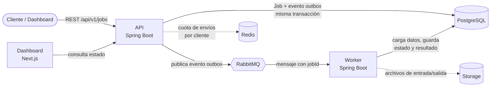

# QueueLab

Plataforma de procesamiento de trabajos asíncronos: un cliente envía un trabajo pesado
por una API REST, el trabajo se encola en RabbitMQ y un worker independiente lo procesa
y guarda el resultado en PostgreSQL. Un dashboard en Next.js permite seguir su estado.

Es un proyecto de estudio centrado en backend, arquitectura y sistemas distribuidos
(colas, idempotencia, reintentos, dead-letter queues, concurrencia, observabilidad…).
Las notas de partida están en [`docs/notas-originales.md`](docs/notas-originales.md).

> **Estado:** en construcción hacia la v1.0.0. Hoy existen los tres procesos (API, worker,
> dashboard) como esqueletos, los servicios locales y las migraciones de base de datos.
> El flujo de trabajos descrito abajo es el diseño objetivo; el backlog está en los
> [issues](https://github.com/Cosmichomeless/QueueLab/issues).

## Arquitectura



Flujo de un trabajo: **cliente → API → RabbitMQ → worker → PostgreSQL / Storage**.

| Proceso | Responsabilidad | Lo que NO hace |
|---|---|---|
| **API** (`backend/api`) | Recibe y valida trabajos, los persiste (`QUEUED`), expone estado y listados, publica los mensajes a RabbitMQ. **Es la dueña del esquema**: ejecuta las migraciones Flyway al arrancar. | No procesa trabajos. |
| **Worker** (`backend/worker`) | Consume mensajes, ejecuta el trabajo, guarda estados (`RUNNING`, `COMPLETED`, `FAILED`, `RETRYING`) y resultado. Sin servidor HTTP. | No expone HTTP ni ejecuta migraciones. |
| **Core** (`backend/core`) | Librería compartida: migraciones SQL y, más adelante, modelo, repositorios y contrato de mensajes. | No es un proceso. |
| **Dashboard** (`frontend`) | Interfaz web que consulta la API. | No habla con RabbitMQ ni con PostgreSQL directamente. |
| **PostgreSQL** | Fuente de verdad del estado de los trabajos. | |
| **RabbitMQ** | Desacopla API y worker; el mensaje solo lleva el identificador del trabajo. | |
| **Redis** | Contadores del límite de envíos por cliente, compartidos entre instancias de la API. | No guarda trabajos ni estado: si cae, la API deja de limitar pero sigue aceptando trabajos. |

Estados de un trabajo: `QUEUED` → `RUNNING` → `COMPLETED` / `FAILED`, con `RETRYING`
entre intentos.

Stack: Java 25, Spring Boot 4.1, PostgreSQL 18, RabbitMQ 4, Redis 7, Flyway, Next.js 16, Docker Compose.
Redis está previsto para más adelante y aún no se usa.

## Estructura del repositorio

```
.
├── backend/            Maven multi-módulo: core, api, worker
├── frontend/           Dashboard Next.js (App Router, TypeScript)
├── docs/               Notas del proyecto y contrato del trabajo CSV (docs/csv-workload.md)
├── docker-compose.yml  PostgreSQL, RabbitMQ y Redis para desarrollo
└── .env.example        Variables de entorno de ejemplo
```

## Puesta en marcha desde cero

### Requisitos

- Docker con Compose v2
- JDK 25 (el Maven Wrapper se incluye: no hace falta instalar Maven)
- Node.js 20.9 o superior y npm

### 1. Configuración

```bash
cp .env.example .env                  # valores de desarrollo; .env no se versiona
cp frontend/.env.example frontend/.env.local
```

### 2. Servicios locales (PostgreSQL, RabbitMQ y Redis)

```bash
docker compose up -d --wait postgres rabbitmq redis   # solo la infraestructura; espera a que estén healthy
```

> Con `docker compose up -d --wait` a secas se levanta **todo el stack** (también API, worker y dashboard en
> contenedores): ver [Stack completo con Compose](#stack-completo-con-compose). No lo mezcles con los pasos 3 y 4:
> la API y el dashboard del contenedor ocupan los puertos 8080 y 3000.

PostgreSQL queda en `localhost:5434`, RabbitMQ en `localhost:5672`
(consola en http://localhost:15672) y Redis en `localhost:6379`. Credenciales de desarrollo: `queuelab` / `queuelab`.

### 3. Backend

```bash
export JAVA_HOME=$(/usr/libexec/java_home -v 25)   # macOS; en Linux, la ruta de su JDK 25
cd backend && ./mvnw verify                        # compila y prueba (las pruebas usan Docker)

# En terminales separadas, desde la raíz del repositorio:
SPRING_PROFILES_ACTIVE=local java -jar backend/api/target/queuelab-api-0.1.0-SNAPSHOT.jar
SPRING_PROFILES_ACTIVE=local java -jar backend/worker/target/queuelab-worker-0.1.0-SNAPSHOT.jar
```

La API escucha en http://localhost:8080 (`/actuator/health`) y aplica las migraciones al
arrancar. El perfil `local` aporta las contraseñas de desarrollo; sin él hay que definir
`QUEUELAB_DB_PASSWORD` y `QUEUELAB_RABBITMQ_PASSWORD`.

### 4. Dashboard

```bash
cd frontend
npm ci
npm run dev                           # http://localhost:3000
```

Otros scripts: `npm run lint`, `npm run typecheck`, `npm run build`. El dashboard llama a la API desde el
navegador (`NEXT_PUBLIC_API_URL`), así que la API debe admitir su origen: por defecto `http://localhost:3000`
(`QUEUELAB_CORS_ALLOWED_ORIGINS`). Detalles en [`frontend/README.md`](frontend/README.md).

### Stack completo con Compose

Para probar el flujo completo sin instalar Java ni Node, solo con Docker:

```bash
docker compose up -d --wait           # construye las imágenes la primera vez (unos minutos) y espera a que estén healthy
# Dashboard: http://localhost:3000 · API: http://localhost:8080/actuator/health
```

Levanta PostgreSQL, RabbitMQ, Redis, la API, el worker y el dashboard; sube un CSV en el dashboard y se procesa de
extremo a extremo. Detalles, puertos, volúmenes y límites en [`docs/compose-stack.md`](docs/compose-stack.md).

### Parar y limpiar

```bash
docker compose down                   # conserva los datos
docker compose down -v                # borra también los volúmenes
```

## Más documentación

- [`backend/README.md`](backend/README.md): variables `QUEUELAB_*`, perfiles y migraciones.
- [`.env.example`](.env.example) y [`frontend/.env.example`](frontend/.env.example): todas las variables explicadas.
- [`docs/performance/benchmark-results.md`](docs/performance/benchmark-results.md): benchmark de throughput y latencia según el límite de concurrencia del worker (reproducible con `docs/performance/benchmark.py`).
- [`docs/performance/capacity.md`](docs/performance/capacity.md): capacidad, trade-offs de cada límite (concurrencia, `prefetch`, contrapresión, cuota, outbox, lease) y cómo cambiarlos con seguridad.
- [`docs/observability/tracing.md`](docs/observability/tracing.md): trazas OpenTelemetry que unen petición HTTP, outbox y worker (spans, configuración, degradación).
- [`docs/observability/metrics.md`](docs/observability/metrics.md): métricas Prometheus de trabajos y cola (catálogo, endpoints y limitaciones).
- [`docs/observability/dashboard.md`](docs/observability/dashboard.md): Prometheus y Grafana locales con el dashboard de cola, reintentos y DLQ (`docker compose --profile observability up -d`).
- [`docs/security/upload-api-review.md`](docs/security/upload-api-review.md): revisión de seguridad de la subida de ficheros y la API.
- [`docs/integration-tests.md`](docs/integration-tests.md): tests de integración con PostgreSQL y RabbitMQ reales (Testcontainers).
- [`docs/e2e-dashboard.md`](docs/e2e-dashboard.md): pruebas e2e del dashboard con Playwright.
- [`docs/containers-backend.md`](docs/containers-backend.md) y [`docs/containers-frontend.md`](docs/containers-frontend.md): imágenes de API, worker y dashboard.
- [`docs/ci-backend.md`](docs/ci-backend.md): CI del backend y el worker en GitHub Actions.
- [`docs/ci-frontend.md`](docs/ci-frontend.md): CI del dashboard (lint, tipos, tests y build) en GitHub Actions.
- [`docs/compose-stack.md`](docs/compose-stack.md): stack completo (API, worker, dashboard, PostgreSQL, RabbitMQ y Redis) con `docker compose up`.
