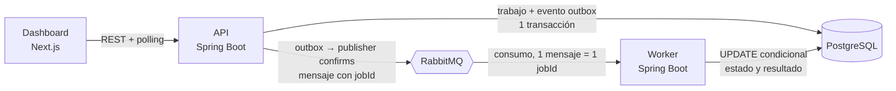

<div align="center">

# QueueLab

**Cola de trabajos asíncronos con API REST, worker independiente y dashboard, para estudiar cómo se construye un sistema distribuido que no pierde trabajos.**

[](https://github.com/Cosmichomeless/QueueLab/actions/workflows/backend.yml)
[](https://github.com/Cosmichomeless/QueueLab/actions/workflows/frontend.yml)


[Probarlo](#probarlo-en-un-comando) · [Capturas](#capturas) · [Arquitectura](#arquitectura) · [Limitaciones](#limitaciones-conocidas) · [Documentación](#documentación)

</div>

QueueLab recibe un CSV por una API REST, lo encola en RabbitMQ y lo procesa en un worker aparte que calcula estadísticas por columna. Es un proyecto de estudio: demuestra outbox transaccional, reintentos, dead-letter queue, idempotencia y observabilidad, no un producto listo para producción.

## Qué incluye

- **Outbox transaccional:** el trabajo y su evento se guardan en la misma transacción de PostgreSQL y un dispatcher los publica con publisher confirms.
- **Entrega al menos una vez, sin ejecutar dos veces:** reclamo atómico en el worker, 3 intentos con espera exponencial, DLQ y recuperación por lease de 2 min.
- **API que se protege:** `Idempotency-Key`, 503 con 1.000 trabajos pendientes y 429 por encima de 60 envíos por minuto y por IP.
- **Un trabajo real:** `csv-import` lee CSV de hasta 10 MiB en streaming y escribe estadísticas por columna.
- **Observabilidad:** métricas Prometheus, dashboard de Grafana, trazas OpenTelemetry y logs con id de correlación.
- **Medido, no supuesto:** con 8 hilos el worker pasa de 8,3 a 40,2 trabajos/s (4,84×) sobre un CSV de 150.000 filas.

## Probarlo en un comando

> **No hay demo pública:** no existe ningún despliegue. Solo corre en local con Docker.

```bash
docker compose up -d --wait   # la primera vez construye las imágenes (unos minutos); dashboard en http://127.0.0.1:3000
```

Pulsa **Nuevo CSV** y sube un fichero. Para parar: `docker compose down`. Servicios, puertos y Grafana: [`docs/compose-stack.md`](docs/compose-stack.md).

## Capturas

| **Lista de trabajos** | **Nuevo trabajo CSV** |
| --- | --- |
|  |  |
| **Trabajo en cola** | **Trabajo completado** |
|  |  |
| **Trabajo fallido** | **Lista en móvil** |
|  |  |

Se regeneran con `./scripts/screenshots.sh`: levanta un Compose limpio (proyecto `queuelab-shots`, sin tocar tus volúmenes), siembra por la API CSV deterministas con datos de `example.com`, captura con Playwright y lo apaga. Necesita los puertos 3000 y 8080 libres, `npm ci` en `frontend/` y `npx playwright install chromium`. Los ids y las fechas cambian en cada ejecución.

## Arquitectura



- **API (`backend/api`):** valida, guarda el trabajo, publica el outbox y sirve estado y resultados. Es dueña del esquema (Flyway); Redis guarda solo los contadores de la cuota.
- **Worker (`backend/worker`):** reclama, ejecuta y escribe el estado (`QUEUED` → `RUNNING` → `COMPLETED` / `FAILED`, con `RETRYING`); lo que no puede procesar acaba en la DLQ.
- **Datos:** PostgreSQL es la fuente de verdad y RabbitMQ solo transporta el `jobId`. Los ficheros viven en un volumen compartido por API y worker.

Máquina de estados, garantías y qué pasa ante cada fallo, con el test que lo respalda: [`docs/architecture.md`](docs/architecture.md).

## Decisiones de diseño

| Decisión | Por qué | Coste |
| --- | --- | --- |
| **Outbox en vez de publicar en RabbitMQ tras el commit** | Si el proceso cae entre el commit y la publicación no se pierde el evento. | Una tabla y un dispatcher más; techo de ≈49 eventos/s por defecto. |
| **Reclamo con `UPDATE ... WHERE status = 'QUEUED'` en vez de locks distribuidos** | Un mensaje duplicado no ejecuta el trabajo dos veces. | Entrega al menos una vez: los duplicados se descartan en el worker. |
| **Mensaje solo con `jobId` en vez de llevar el contenido** | PostgreSQL es la única fuente de verdad; el mensaje no se desfasa. | Cada consumo lee la base de datos. |
| **Concurrencia fija en vez de adaptativa** | Predecible: 8 hilos dan 40,2 trabajos/s. | Con 16 hilos la latencia p50 pasa de 133 a 272 ms sin ganar capacidad. |
| **Cuota en Redis en vez de en memoria** | Los contadores se comparten entre instancias de la API. | Una dependencia más; si Redis cae, no se limita. |

## Limitaciones conocidas

- **Sin autenticación ni autorización propias** (H3): se asume una puerta (Caddy con contraseña) delante; la aplicación no controla el acceso.
- **Cuota por IP del socket** (H4): detrás de un proxy todos comparten contador. Ficheros sin cifrar y sin cuota total (H7).
- **Solo `noop` y `csv-import`**, con una instancia de PostgreSQL, RabbitMQ y Redis; sin purga de `jobs` ni caducidad de la DLQ.
- **Medido en una sola máquina** (Apple M4 Pro), con un worker y una API, y con la cuota y la contrapresión desactivadas.
- **Probado solo en macOS arm64:** Linux, `amd64` y un certificado real no se han probado; las copias son manuales y en el mismo disco.
- **Los e2e del dashboard no corren en CI** y solo se han probado con Chromium.

El seguimiento está en las [issues](https://github.com/Cosmichomeless/QueueLab/issues); no se promete nada que no esté ahí cerrado.

## Calidad

- **332 métodos de test Java** (core 65, api 161, worker 91, e2e 15) con PostgreSQL y RabbitMQ reales (Testcontainers); [`backend.yml`](.github/workflows/backend.yml) ejecuta `./mvnw verify`.
- **59 tests de vitest**; [`frontend.yml`](.github/workflows/frontend.yml) ejecuta lint, tipos, tests y build.
- **4 pruebas e2e de Playwright** con la pila real, lanzadas a mano con `npm run e2e` ([`docs/e2e-dashboard.md`](docs/e2e-dashboard.md)); **no están en CI**.
- **No cubierto:** más de dos réplicas del worker, carga sostenida y marcar los checks como obligatorios en `main` (pendiente).

## Documentación

| Documento | Contenido |
| --- | --- |
| [`docs/architecture.md`](docs/architecture.md) | Piezas, máquina de estados, garantías de entrega y escenarios de fallo. |
| [`docs/development.md`](docs/development.md) | Desarrollo sin contenedores e índice de toda la documentación. |
| [`docs/compose-stack.md`](docs/compose-stack.md) | Stack con Compose: servicios, puertos, volúmenes y réplicas del worker. |
| [`docs/performance/capacity.md`](docs/performance/capacity.md) | Límites del sistema y su coste; resultados en [`benchmark-results.md`](docs/performance/benchmark-results.md). |
| [`docs/deployment/`](docs/deployment/) | Costes, secretos y TLS, copias, Compose público, smoke y vuelta atrás. |
| [`docs/releases/v1.0.0.md`](docs/releases/v1.0.0.md) | Notas de la versión 1.0.0. |

## Estructura

```
.
├── backend/              Maven multi-módulo (Java 25, Spring Boot 4.1)
│   ├── core/             Migraciones SQL, outbox, ficheros y topología de mensajería
│   ├── api/              API REST, outbox y dispatcher
│   ├── worker/           Consumidor, reclamo, reintentos y trabajos
│   └── e2e/              Pruebas end-to-end del backend
├── frontend/             Dashboard Next.js 16 (App Router), vitest y Playwright
├── observability/        Prometheus y dashboard de Grafana
├── docs/                 Documentación, benchmark y capturas
├── scripts/              smoke, rollback, backup, restore y capturas
├── docker-compose.yml    Stack completo y perfil `observability`
└── docker-compose.prod.yml  Configuración pública: secretos, HTTPS y límites de memoria
```

## Despliegue

- **Desplegado:** nada. No hay demo pública ni entorno alojado; el presupuesto es 0 €.
- **Probado solo en local:** `docker-compose.prod.yml` (secretos obligatorios, HTTPS con Caddy, límites de memoria de ≈2,4 GiB), copia y restauración, smoke y vuelta atrás.
- **Solo documentado:** servicios, costes y pasos para un entorno real, en [`docs/deployment/`](docs/deployment/).

## Licencia

[MIT](LICENSE) © 2026 David Rodríguez.
