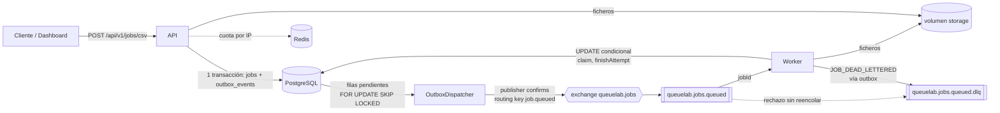
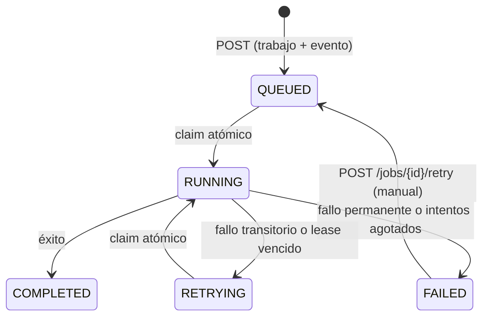

# Arquitectura y garantías de entrega (#63)

Qué piezas tiene QueueLab, qué garantiza cada una y **qué pasa cuando algo falla**. Cada afirmación remite a la
sección de [`backend/README.md`](../backend/README.md) que la detalla y, cuando existe, al test o a la prueba manual que
la comprueba. Lo que no se ha comprobado se dice.

## Piezas

| Pieza | Responsabilidad | Estado propio |
| --- | --- | --- |
| API (`backend/api`) | Validar, guardar trabajo y evento en **una** transacción, servir estado y resultados, publicar el outbox. Dueña del esquema (Flyway) | Ninguno (todo en PostgreSQL) |
| PostgreSQL | **Fuente de verdad**: `jobs`, `outbox_events`, `job_retries` | Volumen `postgres-data` |
| RabbitMQ | Transporta solo el `jobId` (`{"version":1,"jobId":"…"}`) | Colas durables, mensajes persistentes |
| Worker (`backend/worker`) | Reclamar, ejecutar, reintentar, recuperar abandonados, limpiar ficheros | Ninguno |
| Redis | Contadores de la cuota de envíos (60/min por IP) | Ninguno (sin persistencia) |
| Dashboard (`frontend`) | Interfaz; sondea la API | Ninguno |

## Máquina de estados de un trabajo

Un fallo permanente (`JobExecutionException`, o cualquier excepción inesperada) acaba en `FAILED` en el primer intento.
Solo `TransientJobException` reintenta: 3 ejecuciones en total, con espera de 5 s y luego 10 s (×2, máximo 5 min).
`FAILED` solo vuelve a `QUEUED` por el reintento manual, que conserva el `id` y reinicia `attempts` a 0
([reintentos](../backend/README.md#reintentos-con-espera-exponencial), [manual](../backend/README.md#reintento-manual-de-trabajos-fallidos)).

## Qué se garantiza

| Garantía | Cómo | Dónde se comprueba |
| --- | --- | --- |
| **No se acepta un trabajo sin su evento ni al revés** | `jobs` y `outbox_events` se escriben en la misma transacción de PostgreSQL | `EnqueueToCompletionTest` (flujo completo), `ManualRetryTest` (el reintento, igual). **Ningún test fuerza un fallo entre las dos escrituras**: la atomicidad descansa en la transacción de PostgreSQL |
| **Entrega al menos una vez** a RabbitMQ | El evento sigue pendiente hasta que el broker lo confirma (*publisher confirms* + `mandatory`); si el proceso cae justo después de confirmar, se republica | `OutboxDispatcherBrokerDownTest`, `ReliabilityTest` |
| **Sin ejecución doble** de un mismo intento | `UPDATE … WHERE status IN ('QUEUED','RETRYING')`: PostgreSQL serializa y solo un worker obtiene la fila; el cierre exige el mismo número de intento | `ReliabilityTest` (entrega duplicada), `ConcurrencyTest` |
| **Un trabajo `RUNNING` abandonado se recupera** | Lease de 2 min renovado cada ⅓; `AbandonedJobRecoverer` reintenta o marca `FAILED` | `LeaseRecoveryTest`, `ReliabilityTest` (con el estado que deja un worker caído, no con `kill -9`) |
| **Un envío repetido no duplica** | `Idempotency-Key` en `POST /api/v1/jobs` (no existe en la ruta CSV) | `IdempotentSubmitTest`, `ReliabilityTest` |
| **Los fallos no se pierden en silencio** | Intentos agotados → `FAILED` + `JOB_DEAD_LETTERED` en la **misma** transacción → DLQ; mensajes malformados → DLQ | `RetryTest`, `OutboxDispatcherTest` (el evento llega a la DLQ y no a la cola principal), `ReliabilityTest` |
| **La API se protege** | 503 con ≥ 1.000 pendientes (`QUEUED` o `RETRYING`); 429 sobre 60 envíos/min por IP (Redis, falla abierto) | `BackpressureTest`, `RateLimitTest` |
| **Se puede seguir un trabajo de punta a punta** | `X-Correlation-Id` en logs y cabeceras; `traceparent` guardado en `outbox_events.trace_context` | [`docs/observability/tracing.md`](observability/tracing.md) |

Lo que **no** se garantiza: ejecución exactamente una vez. Si un worker pierde sus latidos pero sigue vivo (GC larguísimo,
red cortada), el recuperador puede relevarlo y el trabajo se ejecuta dos veces; el cierre del intento antiguo se rechaza,
pero los efectos del primero (p. ej. el fichero de resultados, que se reescribe) pueden haber ocurrido. Por eso los
ejecutores deben ser idempotentes ([lease](../backend/README.md#recuperación-de-trabajos-interrumpidos-lease)).

## Qué pasa cuando algo falla

| Fallo | Qué ocurre | Comprobado |
| --- | --- | --- |
| La API cae **después** del commit y antes de publicar | El evento está en `outbox_events`; la API (u otra instancia) lo publica al volver | Diseño; `OutboxDispatcherTest` comprueba que un evento pendiente se publica más tarde, **no** una caída real de la API |
| RabbitMQ no está disponible | La API sigue aceptando trabajos (quedan `QUEUED`, el evento acumula `attempts`); al volver el broker se publican y se ejecutan **una vez** | `ReliabilityTest` (con el contenedor parado de verdad) |
| RabbitMQ se reinicia o se mata el contenedor | Colas, mensajes pendientes y DLQ siguen ahí (3 mensajes antes y después, tanto con `restart` como con `kill`) | Prueba manual con Compose ([#60](deployment/data-services-and-backups.md#colas-durables-y-dlq)) |
| Llega el mismo mensaje dos veces | El segundo `claim` no actualiza ninguna fila: se confirma sin ejecutar nada | `ReliabilityTest` (3 copias tras `COMPLETED`: nada cambia) |
| El worker muere a mitad de un trabajo | El lease vence (2 min), el recuperador lo pasa a `RETRYING` con un evento diferido o a `FAILED` | `LeaseRecoveryTest`, `ReliabilityTest`; **no** con un `kill -9` real a mitad de ejecución |
| El fallo es transitorio (p. ej. E/S) | `RETRYING` con espera exponencial; al agotar 3 intentos, `FAILED` + DLQ | `RetryTest`, `RetryPolicyTest` |
| El fallo es permanente (CSV mal formado) | `FAILED` en el primer intento, con la línea y el motivo, sin contenido de la fila; la entrada se conserva 7 días para reintentar | `CsvEndToEndTest` |
| Cola saturada | 503 con `Retry-After`; las lecturas no se rechazan | `BackpressureTest` |
| Redis no responde | La API deja de limitar (falla abierto) y sigue funcionando | Diseño (H4) |
| PostgreSQL no responde | La API deja de estar sana y no acepta; el worker no puede reclamar. Los mensajes esperan en RabbitMQ | **No probado** como escenario |
| Se pierde el volumen de RabbitMQ | No se pierden trabajos: `restore.sh` crea un evento nuevo por cada `QUEUED`/`RETRYING` sin evento pendiente | Prueba manual ([#60](deployment/data-services-and-backups.md#restauración)) |
| Una versión nueva falla | `scripts/rollback.sh <tag>` vuelve a la imagen anterior sin tocar datos; con una migración destructiva hay que restaurar la copia previa | Prueba manual: 20 trabajos en cola terminaron ([#62](deployment/smoke-and-rollback.md)) |

## Qué sacrifica este diseño

Los trade-offs completos, con sus cifras, están en el [README](../README.md#decisiones-de-diseño) y en
[`capacity.md`](performance/capacity.md). En una línea cada uno:

- **Outbox**: ningún trabajo se pierde, pero el techo de publicación es ≈ 49 eventos/s con la configuración por defecto
  (con lote 200 y 100 ms: 543 eventos/s en `noop`).
- **Al menos una vez + reclamo condicional**: sin locks distribuidos, pero los duplicados llegan al worker y se descartan allí.
- **PostgreSQL como única fuente de verdad**: el mensaje no se desfasa, pero cada consumo es una lectura.
- **Concurrencia fija**: predecible (1→8 hilos = 4,84×) y sin autoajuste; con 16 hilos la latencia p50 se duplica (133→272 ms).
- **Una sola instancia de cada servicio de datos**: no hay alta disponibilidad de PostgreSQL, RabbitMQ ni Redis.

## Reproducir el entorno

1. **Todo en contenedores** (lo más corto): `docker compose up -d --wait` y abrir `http://127.0.0.1:3000`
   ([`compose-stack.md`](compose-stack.md)). Necesita Docker; la primera vez construye las imágenes.
2. **Comprobar que funciona**: `scripts/smoke.sh` (sube un CSV y verifica el resultado).
3. **Desarrollo sin contenedores** para API, worker y dashboard: [`development.md`](development.md).
4. **Configuración pública en local** (HTTPS y acceso con contraseña): [`deployment/deploy-compose.md`](deployment/deploy-compose.md).
5. **Repetir las medidas**: `python3 docs/performance/benchmark.py` ([`benchmark-results.md`](performance/benchmark-results.md)).
6. **Regenerar las capturas**: `./scripts/screenshots.sh`.

Todo se ha probado en macOS arm64 con Docker Desktop. **Linux y `amd64` no se han probado.**

## Fuera de alcance

Autenticación y autorización propias (H3), cuota real por cliente detrás de un proxy (H4), cifrado de ficheros y cuota
total de almacenamiento (H7), purga de `jobs` y `outbox_events`, caducidad de la DLQ, copias automáticas o fuera de la
máquina, alta disponibilidad y un entorno alojado. Ver [Limitaciones](../README.md#limitaciones-conocidas) y las
secciones «No verificado» de [`docs/deployment`](deployment/).
